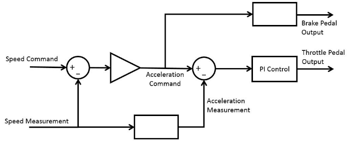
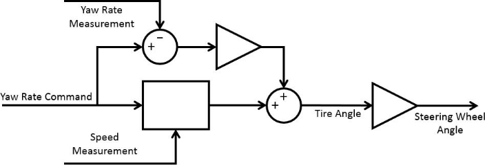

**ROS Interface to Lincoln MKZ System**

 

**Vehicle Commands**

|**Topic**||**Type**||**Rate**||**Info**|
| - | :- | - | :- | - | :- | - |
|/vehicle/brake\_cmd|d|[bw_mkz_msgs/BrakeCmd](http://docs.ros.org/api/dbw_mkz_msgs/html/msg/BrakeCmd.html)|H50|z|pedal|position or braking torque, enable,|
|||||||(boo\_cmd is automatically set)|
|/vehicle/throttle\_cmd|d|[bw_mkz_msgs/ThrottleCmd](http://docs.ros.org/api/dbw_mkz_msgs/html/msg/ThrottleCmd.html)|50 Hz||pedal|position,enable|
|/vehicle/steering\_cmd|d|[bw_mkz_msgs/SteeringCmd](http://docs.ros.org/api/dbw_mkz_msgs/html/msg/SteeringCmd.html)|50 Hz||steerin|g wheel angle, enable|
|/vehicle/gear\_cmd|d|[bw_mkz_msgs/GearCmd](http://docs.ros.org/api/dbw_mkz_msgs/html/msg/GearCmd.html)|On-E|vent|none/|park/reverse/neutral/drive/low|
|/vehicle/turn\_signal\_cmd|db|[w_mkz_msgs/TurnSignalCmd](http://docs.ros.org/api/dbw_mkz_msgs/html/msg/TurnSignalCmd.html)|20 Hz||none/le|ft/right|
|/vehicle/cmd\_vel\_with\_limits|db|[w_mkz_msgs/TwistCmd](http://docs.ros.org/api/dbw_mkz_msgs/html/msg/TwistCmd.html)|H> 5|z|linear/|angularvelocity, accel/decel limits|
|/vehicle/cmd\_vel\_stamped|ge|[ometry_msgs/TwistStamped](http://docs.ros.org/api/geometry_msgs/html/msg/TwistStamped.html)|H> 5|z|linear/|angularvelocity|
|/vehicle/cmd\_vel|g|[eometry_msgs/Twist](http://docs.ros.org/api/geometry_msgs/html/msg/Twist.html)|> 5|Hz|linea|r/angularvelocity|
**2 Vehicle Data**

|**Topic**||**Type**||**Rate**||**Info**|
| - | :- | - | :- | - | :- | - |
|/vehicle/dbw\_enabled|st|[d_msgs/Bool](http://docs.ros.org/api/std_msgs/html/msg/Bool.html)|On-|Change|enabl|ed|
|/vehicle/brake\_report|d|[bw_mkz_msgs/BrakeReport](http://docs.ros.org/api/dbw_mkz_msgs/html/msg/BrakeReport.html)|H50|z|pedal|position,braking torque, enable|
|/vehicle/brake\_info\_report|db|[w_mkz_msgs/BrakeInfoReport](http://docs.ros.org/api/dbw_mkz_msgs/html/msg/BrakeInfoReport.html)|50 Hz||quetor|s,abs/pbrake/hsa statuses|
|/vehicle/throttle\_report|db|[w_mkz_msgs/ThrottleReport](http://docs.ros.org/api/dbw_mkz_msgs/html/msg/ThrottleReport.html)|50 Hz||pedal|position,enable|
|/vehicle/throttle\_info\_report|db|[w_mkz_msgs/ThrottleInfoReport](http://docs.ros.org/api/dbw_mkz_msgs/html/msg/ThrottleInfoReport.html)|H100|z|engine|RPM|
|/vehicle/steering\_report|db|[w_mkz_msgs/SteeringReport](http://docs.ros.org/api/dbw_mkz_msgs/html/msg/SteeringReport.html)|50 Hz||steerin|gwheel angle and torque, vehicle|
|||||||speed, enable|
|/vehicle/gear\_report|d|[bw_mkz_msgs/GearReport](http://docs.ros.org/api/dbw_mkz_msgs/html/msg/GearReport.html)|H20|z|encurr|tgear|
|/vehicle/misc\_1\_report|d|[bw_mkz_msgs/Misc1Report](http://docs.ros.org/api/dbw_mkz_msgs/html/msg/Misc1Report.html)|H20|z|s turn|ignals,buttons, wipers, high beams,|
|||||||ambient light|
|/vehicle/wheel\_speed\_report|db|[w_mkz_msgs/WheelSpeedReport](http://docs.ros.org/api/dbw_mkz_msgs/html/msg/WheelSpeedReport.html)|100 Hz||s wheel|peeds,magnitude only|
|/vehicle/surround\_report|db|[w_mkz_msgs/SurroundReport](http://docs.ros.org/api/dbw_mkz_msgs/html/msg/SurroundReport.html)|5 Hz||parking|sonars, blind spot, cross trafficalert|
|/vehicle/tire\_pressure\_report|db|[w_mkz_msgs/TirePressureReport](http://docs.ros.org/api/dbw_mkz_msgs/html/msg/TirePressureReport.html)|2 Hz||estire pr|sure (4 wheels)|
|/vehicle/fuel\_level\_report|d|[bw_mkz_msgs/FuelLevelReport](http://docs.ros.org/api/dbw_mkz_msgs/html/msg/FuelLevelReport.html)|10 Hz||le fuel|vel|
|/vehicle/imu/data\_raw|sen|[sor_msgs/Imu](http://docs.ros.org/api/sensor_msgs/html/msg/Imu.html)|100|Hz|accel,|gyro, missing pitch gyro|
|/vehicle/gps/fix|se|[nsor_msgs/NavSatFix](http://docs.ros.org/api/sensor_msgs/html/msg/NavSatFix.html)|1 Hz||latitu|de,longitude, altitude|
|/vehicle/gps/vel|ge|[ometry_msgs/TwistStamped](http://docs.ros.org/api/geometry_msgs/html/msg/TwistStamped.html)|1 Hz||velocit|yin global frame|
|/vehicle/twist|g|[eometry_msgs/TwistStamped](http://docs.ros.org/api/geometry_msgs/html/msg/TwistStamped.html)|H50|z|speed|and yaw rate computed from steering|
|||||||report|
**Twist Controller Node**

1. **Subscribed Topics**

cmd\_vel ( [geometry_msgs/Twist )](http://docs.ros.org/api/geometry_msgs/html/msg/Twist.html)

Desired forward speed and yaw rate command. **linear.x** should have the forward speed in m/s, and **angular.z** should have the yaw rate in rad/s. Acceleration limits are set via dynamic reconfigure.

cmd\_vel\_stamped ( [geometry_msgs/TwistStamped )](http://docs.ros.org/api/geometry_msgs/html/msg/TwistStamped.html)

Same as the **cmd\_vel** topic. This topic is supported simply for compatibility reasons. As such, the node ignores the time stamp.

cmd\_vel\_with\_limits ( [dbw_mkz_msgs/TwistCmd )](http://docs.ros.org/api/dbw_mkz_msgs/html/msg/TwistCmd.html)

Same as the **cmd\_vel** topic, except the acceleration limits can be set by the **accel\_limit** and **decel\_limit** fields of the message. The dynamic reconfigure acceleration limits are still used as absolute maximum values, but the **accel\_limit** and **decel\_limit** values can be used to specify more restrictive acceleration limits.

steering\_report ( [dbw_mkz_msgs/SteeringReport )](http://docs.ros.org/api/dbw_mkz_msgs/html/msg/SteeringReport.html)

Steering report message published from the main drive-by-wire node. Used to extract the vehicle speed measurement, which provides feedback to the outer speed control loop, and is used to derive a filtered acceleration estimate for the inner acceleration control loop.

imu/data\_raw ( [sensor_msgs/Imu )](http://docs.ros.org/api/sensor_msgs/html/msg/Imu.html)

Built-in vehicle IMU data published from the main drive-by-wire node. Used to obtain yaw rate measurement.

dbw\_enabled ( [std_msgs/Bool )](http://docs.ros.org/api/std_msgs/html/msg/Bool.html)

System-level enable signal published from the main drive-by-wire node. Used to avoid undesirable integrator wind-up.

fuel\_level\_report ( [dbw_mkz_msgs/FuelLevelReport )](http://docs.ros.org/api/dbw_mkz_msgs/html/msg/FuelLevelReport.html)

Current fuel level percentage published from the main drive-by-wire node. Used to account for fuel mass when using vehicle mass for deceleration control.

2. **Published Topics**

throttle\_cmd ( [dbw_mkz_msgs/ThrottleCmd )](http://docs.ros.org/api/dbw_mkz_msgs/html/msg/ThrottleCmd.html)

Throttle pedal command output to main drive-by-wire node.

brake\_cmd ( [dbw_mkz_msgs/BrakeCmd )](http://docs.ros.org/api/dbw_mkz_msgs/html/msg/BrakeCmd.html)

Brake pedal command output to main drive-by-wire node.

steering\_cmd ( [dbw_mkz_msgs/SteeringCmd )](http://docs.ros.org/api/dbw_mkz_msgs/html/msg/SteeringCmd.html)

Steering wheel command output to main drive-by-wire node.

3. **Parameters**

~control\_rate (float64,default: 50.0)

Control loop execution rate in Hz.

4. **Dynamic ReconfigureParameters**

~pub\_pedals (bool, default: True)

Enable the publishing of the throttle and brake pedal commands.

~pub\_steering (bool, default: True)

Enable the publishing of the steering wheel command.

~speed\_kp (float64,default: 2.0)

Proportional gain for outer speed control loop.

~decel\_max (float64,default: 3.0)

Maximum amount of deceleration output allowed from the inner acceleration control loop (m/s2). ~accel\_max (float64,default: 3.0)

Maximum amount of acceleration output allowed from the inner acceleration control loop (m/s2).

~max\_lat\_accel (float64,default: 8.0)

Maximum lateral acceleration allowed by the steering controller. Requested yaw rate is ignored to saturate the lateral acceleration to this parameter’s value.

~steer\_kp (float64,default: 0.0)

Proportional gain on the closed loop term of the feed-forward steering controller.

~wheel\_radius (float64,default: 0.2413)

Effective wheel radius in meters.

~vehicle\_mass (float64,default: 1736.35)

Curb weight of vehicle in kg.

~fuel\_capacity (float64,default: 13.5)

Fuel tank capacity in gallons.

~accel\_kp (float64,default: 0.4)

Proportional gain for the inner acceleration control loop.

~accel\_ki (float64,default: 0.1)

Integral gain for the inner acceleration control loop.

~brake\_deadband (float64,default: 0.1)

Amount of deceleration that must be requested before braking is applied (m/s2).

~accel\_tau (float64,default: 0.5)

Time constant in seconds for the acceleration feedback measurement filter.

5. **Controller Structure**
1. **Speed Controller**

Figure 1 shows a diagram of the speed controller, which inputs a speed command and produces throttle and brake pedal outputs to achievethatspeed. Thevehiclespeedmeasurementfeedbackcomesfromthe **steering\_report** topic. Accelerationfeedbackisderivedby running the speed measurement through a differentiator and first-order low pass filter, where the time constant *τ* is set by the **accel\_tau** parameter.

The outer speed control loop uses proportional control with gain *Kp*, whose value is set by the **speed\_kp** dynamic\_reconfigure parameter. The output of the controller is an acceleration command, whose value is clamped between the maximum acceleration andd deceleration values set on the **accel\_max** and **decel\_max** parameters.

       Figure 1:- Diagram of the speed controller

       Figure 2:-Diagram of the feed-forward steering controller

2. **Steering Controller**

Steering control is implemented with a feed-forward proportional controller, a diagram of which is shown in Figure 2. The requested yaw rate and current speed measurement are used to compute a nominal steering angle based on a simple kinematic bicycle model. The wheelbase length *L* for the MKZ is 112.2 inches.

A closed loop term is added, where the error between requested and actual yaw rate is multiplied by the gain *Kp* set on the **steer\_kp** parameter. This combined tire angle is then converted to steering wheel angle by multiplying by the steering ratio *γ*, which was experimentally determined to be 16:1.